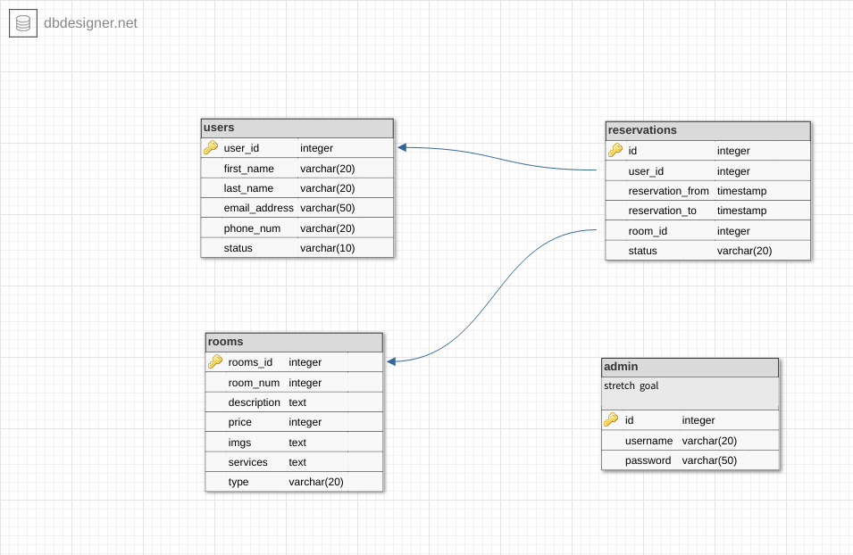

# Marna House Hotel

[Our prototype](https://www.figma.com/file/Be2UrCoirdZzoQ2bIB49qHh4/Untitled?node-id=0%3A1)

### Problem Statement
Marna House Hotel does not have a technological reservation system. The reservation depends on the telephone or e-mail, and then manually inserting the data into the databases, which takes a lot of time and effort. There is also no specific method followed by customers when booking to be able to view and choose the best services.

______
### Our Solution
Building a site that contains a booking system where customers can choose the right time and services they want and then review the rooms available and can book after registration on the site and without paying a reservation fee.


______

### User Journey:

*As a client*
- I want to be able to choose the right booking time for me
- Choose the right rooms and best services
- Booking without paying a fee only by recording the most important data required for me
- Ability to review rooms and services

*As a manager & staff member*
- I need a unified reservation system for all customers
- I want to save time and effort in the process of entering customer data into databases
- I want to increase customer satisfaction and satisfaction with our services
______

### How to run the Server
- clone repo by run ```git clone https://github.com/FACG5/Marna-House.git ```- in your terminal.
- Create config.env file.
- Add DB_URL and SECRET to it.
- run ```npm install```
- run ```npm run dev```
_______

### How to run the tests
run ```npm test``` in your terminal

_______

### DataBase Schema


_____

### Tech stack
- HTML5
- CSS3
- JavaScript
- Handlebars
- Express.js
- PostgresSQL
_____
### Our Team
Kanaan Hassouna

Donia Hassouna
